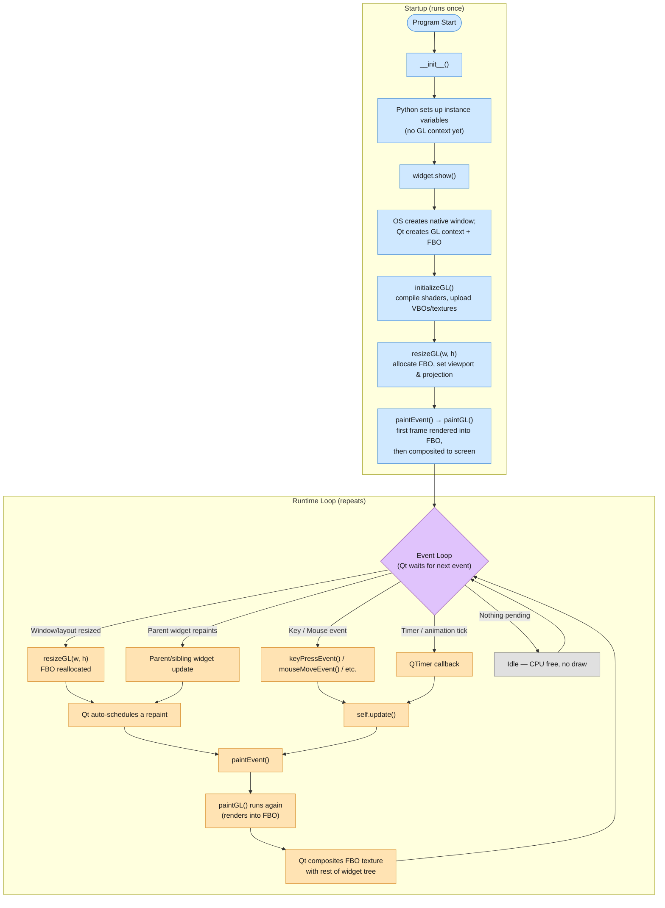

# NDimLab

[](https://www.python.org/downloads)

NDimLab is a Python library for working with and visualizing n-dimensional matrices and polygons.

## Qt Dark Mode in Virtual Environments

PySide6 inside a Python virtual environment uses its own plugin directory, which does not include system Qt theme plugins (like `qt6ct`). Because of this, Qt cannot detect the system’s dark mode and falls back to the **Fusion light theme**. So manually point Qt to the system plugin paths by adding these lines to the bottom venv `bin/activate` script:

```bash
export QT_PLUGIN_PATH=/usr/lib/qt6/plugins
export QT_QPA_PLATFORMTHEME=qt6ct
export QT_QPA_PLATFORMTHEME_PATH=/usr/lib/qt6/plugins/platformthemes
```

This restores proper dark‑mode support when running inside the venv.

## Hovering / Showing Point Coordinates

Calculate coordinates lazily. When a user hovers over a specific vertex, grab that one point from copy of the original array, multiply it by the current matrix on the CPU, and push it to the UI label.

## Live Global Coordinate Spreadsheet/List

If user toggles a view showing all current coordinates changing in real time, execute the full NumPy multiplication (`live_points = original_points @ combined_matrix`) only while that UI panel is open.

## QOpenGLWidget execution order

- **`initializeGL()`** is guaranteed to run once before the first time `resizeGL()` or `paintGL()` is called.
- **`initializeGL()`** can technically be called again if the underlying GL context is destroyed and recreated (e.g. the widget is reparented into a different top-level window, or the driver resets the context).
- Unlike `QOpenGLWindow`, a `QOpenGLWidget` renders into an off-screen **framebuffer object (FBO)**, not directly to the native window surface. Qt then composites that FBO's texture into the normal widget-painting pipeline alongside sibling widgets.
- **`resizeGL()`** fires whenever the widget is resized, and also on first show, since new widgets get an automatic resize event. It's also where the backing FBO gets reallocated at the new size.
- **`update()`** is the correct way to *request* a repaint from outside `paintGL()`, but it's *asynchronous*: it schedules a `paintEvent()` on the event loop rather than calling `paintGL()` directly.
- `paintGL()` isn't called by Qt's window system directly - it's invoked from inside `QOpenGLWidget::paintEvent()`, which itself is driven by the same widget-update mechanism as any other `QWidget` (so it can also be triggered indirectly by parent-widget repaints, not just `update()` calls).



**Note:** with `QOpenGLWindow` the `paintGL()` method draws essentially straight to the screen surface, but with `QOpenGLWidget` it draws into an FBO first, and that FBO is then blended into the rest of the widget hierarchy like any other widget's content. That's what makes `QOpenGLWidget` composable with normal Qt widgets (possible to layer a `QPushButton` on top of it, put it in a layout, etc.) at the cost of an extra copy/blit per frame.

## TODO

Matrix & NDC Optimization (Homogeneous 'w' Scaling):

- Keep original 2D/3D mesh points static in VRAM (VBO). Do NOT update vertex arrays on CPU during window/viewport resize.
- Update the single Uniform Projection Matrix on resize instead:
  - Scale terms in matrix (like bottom-right 'w' or matrix scale factors) handle aspect ratio and global unit scaling.
  - Recall: NDC (Normalized Device Coordinates) expects coordinates mapped from -1 to +1.
      The GPU auto-performs Perspective Divide (x/w, y/w, z/w) post-vertex shader.

Evaluate Migration to Slang Shading Language:

- Language & Features:
  - Slang uses modern C#-like syntax (attributes `[...]`, generics, interfaces, modules).
  - FOSS & Vendor-Neutral: Hosted by Khronos Group (multi-vendor governance).
  - Code Once, Target Anything: Compiles to SPIR-V (Vulkan), HLSL (DX12), MSL (Metal), CUDA, or GLSL.

- ModernGL / Python Integration:
  - Use `slangc` CLI or Slang API to emit GLSL target strings (`-target glsl`).
  - Pass compiled GLSL output into `ctx.program(...)` in ModernGL.
  - Check out `slangpy` if integrating GPU compute shaders with PyTorch/NumPy workflows.
